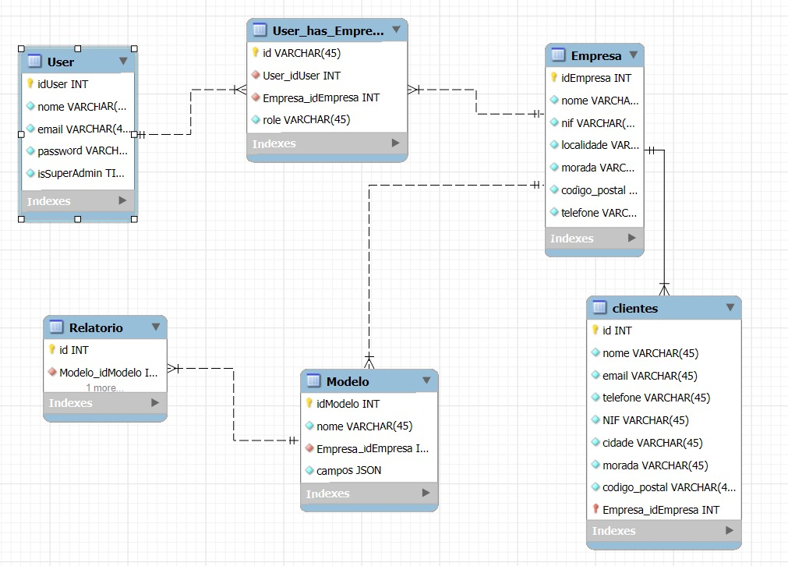

# Projeto PFire
**Pfire** é uma aplicação de geração de relatórios de inspeção de segurança de dispositivos de emergência e socorro. Segue-se agora uma explicação detalhada de como executar o código e como proceder consoante futuras atualizações.

## Instruções
Este projeto utiliza a implementação **FARM STACK Application**. Ou seja, **FastAPI** no **backend**, **React** no **frontend**, e **MongoDB** como sistema de base de dados. As duas primeiras tecnologias rodam em contêineres **Docker** na produção. Antes de escrever qualquer comando, certifique-se de ter aberto o seu editor de código com privilégios de administração. Caso utilize um sistema operativo não baseado em **UNIX** (ex: **Windows**), é altamente recomendada a instalação do **WSL** para a execução de alguns comandos.

### Como Clonar o Projeto
A primeira coisa a fazer é clonar o repositório, utilizando estes comandos no terminal para tal: 
1. `git clone https://gitlab.com/protecao24h/pfire.git`
2. `cd /pfire`

### Pré-requisitos
- O **Docker** e o **Docker Compose** precisam obrigatoriamente de estar instalados para testar como a aplicação se comporta em produção.
- Se pretender testar a aplicação apenas para desenvolvimento, poderá executar os servidores **frontend** e **backend** individualmente.

**ATENÇÃO!** De modo que o programa consiga rodar sem problemas, é necessária a criação de um ficheiro `.env` na raiz do projeto. Este ficheiro será responsável por guardar dados sensíveis, como por exemplo a URL de acesso à base de dados **MongoDB** e chaves de criptografia que poderão vir a ser necessárias. 

### Como Criar Ficheiro .env 
Crie o ficheiro `.env` no diretório raiz do projeto, exatamente com este nome. De seguida, guarde os seguintes dados:

- `MONGO_URL = 'mongodb+srv://<db_username>:<db_password>@pfire.c9mvo.mongodb.net/?retryWrites=true&w=majority&appName=pfire'`
- `PRIVATE_KEY_PASSWORD='password'`
- `PROJECT_ID= 'projeto_id'`
- `API_KEY='api_key'`

Os dados aqui indicados deverão ser substituidos pelos respetivos dados verdadeiros de cada desenvolvedor

**AVISO**: Para fins de desenvolvimento, será necessário criar a sua própria base de dados em MongoDB. A base de dados utilizada em produção encontra-se sob o mais restrito acesso. 

### Diagrama de Base de Dados

### Chaves de Criptografia JWT
Este projeto utiliza um sistema de autenticação baseado em JWT no `backend`, tal como poderá ser visualizado no seguinte ficheiro python: `backend\controller\auth.py`. Para testar o desenvolvimento, será necessário criar um par de chaves de criptografia dentro de uma pasta de nome `chaves` exatamente como especificado no ficheiro `auth.py`. É importante criar a pasta `chaves` com este nome, para que o seu conteúdo seja ignorado pelo `.gitignore`, preservando assim o comprometimento das chaves de criptografia.

#### Criar chaves de criptografia
1. `cd /backend`
2. `mkdir chaves`
3. `cd backend`
3. `openssl genpkey -algorithm RSA -aes-256-cbc -out privada.pem`
4. Crie uma password para proteger a chave privada(deverá ser **EXATAMENTE** igual a **PRIVATE_KEY_PASSWORD** que foi definido no ficheiro `.env`)
5. `openssl rsa -in privada.pem -pubout -out publica.pem`

### Como Executar Servidores para Desenvolvimento

**AVISO**: É altamente recomendada a execução dos próximos comandos aqui apresentados, utilizando `WSL`, caso trabalhe numa máquina que não use `Linux`. Lembrando que este é instalado automaticamente com o `Docker`. De seguida, deverá ser criada uma máquina `Linux` para utilizar o `WSL`, como por exemplo `Ubuntu` ou `Debian`.

#### Instalar Ubuntu no WSL:
1. Abra o Powershell
2. `wsl --install`
3. Crie um utilizador e password para o `Ubuntu`
4. `sudo apt update && sudo apt full-upgrade -y`

Opcionalmente, podemos tornar a máquina `Ubuntu` como a máquina padrão do `WSL` com este comando:

`wsl --set-default Ubuntu`

**AVISO**: De modo a garantir que não haja nenhum problema no futuro, é altamente recomendada a repetição do passo 4. Assim, a máquina `Ubuntu` ficará sempre atualizada.

#### Executar Frontend:
1. `cd /frontend`
2. `npm install`
3. `npm run dev` 

#### Executar Backend: 
1. `cd /backend`
2. `sudo apt install python3-venv`
3. `python3 -m venv venv`
4. `source venv/bin/activate`
5. `pip install -r requirements.txt`
6. `uvicorn main:app --reload`

### Como Executar a Aplicação no Geral para Produção
Para testar como a aplicação irá ser executada em produção, bastará utilizar o seguinte comando no diretório raiz do projeto, assumindo que tenha privilégios de administração e que o docker esteja devidamente instalado.

- `docker-compose up --build`

### Como Instalar Novas Dependências
Caso sejam adicionadas novas dependências, estas deverão ser comunicadas o mais claramente possível, para que seja possível avaliar se estas podem ser incluídas no projeto e quais versões serão utilizadas.

#### Como Atualizar o Backend
De tempos a tempos, o ficheiro requirements.txt poderá vir a ser alterado para incluir as novas dependências ou versões.

Caso tenha sido instalada uma nova dependência do python ou uma nova versão de uma já existente com o `pip install`, estas mudanças deverão ser justificadas no `merge request` após o `git push` do novo `commit`. Não esquecendo de gerar o ficheiro `requirements.txt` de novo, desta vez com a lista de dependências do **backend** atualizada:

**AVISO:** Este comando deve ser executado com estrema responsabilidade, somente se forem instaladas/atualizadas dependências cruciais para o bom funcionamento da aplicação. Não execute este comando em caso de instalação de novas dependências, apenas para fins de testagem de código, análise de vulnerabilidades,etc. 

`pip freeze > requirements.txt`

#### Como Atualizar Frontend
Tal como o **backend**, também existem ficheiros que contêm dependências utilizadas no **frontend**: `package.json` e o `package-lock.json`. Estes ficheiros também podem vir a ser alterados, felizmente estes são atualizados automaticamente sempre que uma nova dependência é atualizada ou instalada. Para obter as dependências atualizadas basta executar o seguinte comando: 

`npm install`

**AVISO:** Em caso de alguma mudança nestes ficheiros: `backend\requirements.txt`, `frontend\package.json`, `frontend\package-lock.json`, por favor justifique a sua alteração. Poderão haver problemas de incompatibilidade em caso de instalações de novas dependências, ou atualizações das mesmas. Assim sendo, estas mudanças deverão ser unicamente enviadas num `commit` reservado apenas para esse efeito. **Não serão aceites commits que contenham mudanças não justificadas nestes ficheiros, para futuras avaliações de `merge requests`**

### Branch Main e Develop
Como é possível verificar, o projeto contém dois branches principais: `main` e `develop`. Nós vamos trabalhar com a lógica do `git flow`, o que significa que qualquer alteração direta do branch `main` e `develop` direcionada para o repositório remoto (`git push`) encontra-se devidamente protegida. Só é possível atualizar estes branches mediante um `git merge` previamente solicitado (através de um `merge request`) e/ou avaliado pelos administradores deste repositório como uma alteração do projeto válida.

**AVISO**: É extremamente importante que todo o trabalho seja feito na branch `develop`, ou em ramificações da mesma.

### Como Observar o Projeto a Funcionar
O **backend** estará em [http://localhost:8000](http://localhost:8000) e o **frontend** em [http://localhost:3000](http://localhost:3000). Lembrando que os seguintes URLs estarão apenas disponíveis no caso da execução explícita dos servidores para desenvolvimento (*ver Como Executar Servidores para Desenvolvimento*). No caso da execução da aplicação geral utilizando o `docker-compose`, o **backend** não estará acessível de forma direta, mas sim isolado na rede privada do `docker`, e o **frontend** ficará acessível na porta **HTTP/HTTPS**. Isto acontece porque o **docker** executa a aplicação para produção, pelo que não faria sentido tornar o **backend** acessível, nem incluir uma porta disponível para os utilizadores finais. 

### Como Atualizar o Projeto
Para obter as últimas alterações do projeto execute o comando `git pull` principalmente no branch `develop`. Se for necessário, instale as dependências do `backend` e do `frontend` com os comandos previamente indicados.

### Comandos Úteis do Docker
- Para parar e destruir os contêineres: `docker-compose down`
- Para rodar os contêineres em segundo plano: `docker-compose up -d`

### Pipeline e Verificação de Segurança
Quando for publicada uma nova alteração, a `pipeline` será executada no servidor. Esta fará uma simples análise de segurança, para garantir que não é enviado código malicioso. Caso seja detectada uma vulnerabilidade, o `commit` enviado ficará marcado como **failed**. Isto vai informar os administradores que aquele `commit` possui vulnerabilidades de segurança.
Por esta razão, é fortemente indicada a efetuação de uma análise de vulnerabilidades antes de executar `git push`. Os comandos utilizados para tal estão listados no ficheiro `.gitlab-ci.yml`.
Não serão aceites commits marcados como **failed** em merge requests.

### Comunicação entre Frontend e Backend
Os endpoints das `APIs` foram definidos em `python`, utilizando a framework do **FastAPI**. Para aceder ao `backend` pelo `frontend`, bastará realizar um fetch para `/backend`, por exemplo: `fetch("/backend")` e a comunicação entre os dois contêineres será estabelecida. Para aceder ao resto dos endpoints, será necessário consultar as rotas previamente estabelecidas na seguinte pasta: `backend\routes`.

## Conclusão
Este projeto foi elaborado e organizado de modo que o desenvolvimento corporativo fosse o mais simples e organizado possível. Em caso de alguma dúvida, por favor entre em contacto com Miguel Gonçalves!

Email: miguelgoncalves2024@hotmail.com
Whatsapp: +351938946732